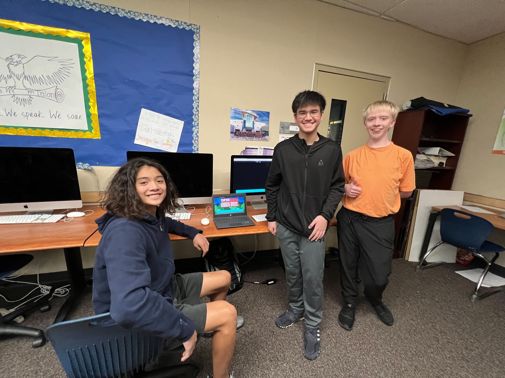

Blog / article on you and team

something you saw in CompSci that impressed
something you saw outside of CompSci that you liked

# Night At the Museum

## Who Are We?

We are the MULTIPLAYERS!

### Multiplayer:
- Trystan Schmits
- Matthew Sean Borabo
- Ian Manangan
- Gavin Ireland

### Helpers:
- Management Overseer: Ryan Nguyen
- Teacher Assistant: Rohan Juneja

## What Went Well:

- I was presenting in Night at the Museum in the first 30 minutes upon opening. Unfortunately, we were the only CSSE team presenting at that team, but it was still successful. Although Gavin wasn't able to show up due to conflicts outside of school, Ryan was able to join our team for the night!
- I got to show my game to Mr. Lopez, and his sprite on Level 2 of the game. For some of the students, we showed the 'notification' feature of the chat (very obnoxious!). 
- All four of us were presenting to students and parents about our Mario game! We talked about the general features, what we worked on specifically (Multiplayer), and how long it took to make the game! One parent (which I believe is a parent of an AP CompSci student) somewhat challenged me! She asked me what the frontend and backend is, what we learn in CSSE compared to the other AP classes, and the programming language that we use. I mentioned that CSSE is only a two trimester course as it is a prerequisite to future CompSci classes and that we mainly use JavaScript. It took me a moment to answer the frontend and backend question as we didn't focus much on scrum roles this trimester (e.g. Scrum Master, Devops) due to everyone in the class working on the same game. Everyone else that I talked to was very curious as well.

## Outside of CSSE

