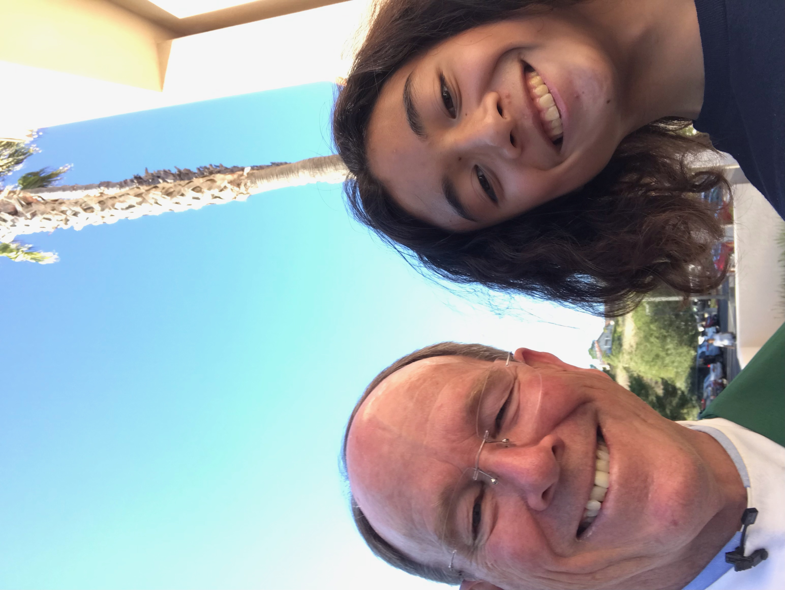



  <!--- Liquid concatentation --->
  <!--- Liquid list variable created from file containing mario metatdata for sprite --->
 <!--- Liquid integer assignment --->

<!--- HTML for page contains 
 tag named "mario" and class properties for a "sprite"  -->

  
<!--- Embedded Cascading Style Sheet (CSS) rules, defines how HTML elements look --->

<!--- Embedded executable code--->

# Welcome to my website! :D

  Hello! My name is Matthew Borabo and I am very eager to be in Computer Science & Software Engineering! I am a junior at Del Norte High School and my favorite activity to do in my free time is to play the piano! I’ve played piano since I was around 7 years old (~10 years ago) and I am very involved in Cerificate of Merit, a music program that contains multiple levels of musical knowledge in theory and performance.

## Background
I am currently interested in the field of Computer Science, leading me to take Computer Science and Software Engineering (CSSE). Beforehand, I took Computer Animation 1-2 as a freshmen. Initially, I was thinking of becoming an electrical engineer (or the engineering field) when I was younger but now I am having trouble in picking one of the two fields. Both of these fields both have some math (and science) since I have a deep passion for math, in which I am currently taking Calculus 1.

## My Classes 

### First Trimester
 - Period 1 - American Literature (Mr. West)
 - Period 2 - Calculus 1 (Mrs. Hightower)
 - Period 3 - Computer Science and Software Engineering (Mr. Lopez)
 - Period 4 - Learning Strategies (Ms. Parmley)
 - Period 5 - AP Physics C: Mechanics (Mr. Eckman)

### Second Trimester
  - Period 1 - AP Physics C: Mechanics (Mr. Liao)
  - Period 2 - US History 1 (Mrs. Smith)
  - Period 3 - Calculus 1 (Mrs. Hightower)
  - Period 4 - Computer Science and Software Engineering (Mr. Mortensen)
  - Period 5 - Learning Stratiegies (Ms. Camerino)

## Overall Goal for this Class
 I hope I will be able to get a good grade in this class, no matter how much time that I will have to spend in and out of class. It may be a slow start to learn all about the terminal and basic coding fundamentals, but I will eventually be able to show that I am capable of being a good coder! :D

## About My First Partner!

  My partner is Ian and I’ve known ever since we were in elementary school! His favorite sport is volleyball as it has many dynamics and strategies to the game! He is a sophomore and he plays a variety of video games such as Apex Legends, Valorant, and sometimes Pokemon. He is very friendly and kind, especially when I met him for the first time during my 2nd year of elementary school. I’m glad that he is my teammate for the entire trimester and I hope to know more about him during this course! :D

- Plans, Lists, [Scrum Boards](https://clickup.com/blog/scrum-board/) help you to track key events, show progress and record time.  Effort is a big part of your class grade.  Show plans and time spent!
- [Hacks(Todo)](https://levelup.gitconnected.com/six-ultimate-daily-hacks-for-every-programmer-60f5f10feae) enable you to stay in focus with key requirements of the class.  Each Hack will produce Tangibles.
- Tangibles or [Tangible Artifacts](https://en.wikipedia.org/wiki/Artifact_(software_development)) are things you accumulate as a learner and coder. 

## Investing in your Technical Future

Explore the Computer Science Pathway at Del Norte High School. All Del Norte CompSci classes are designed to provide a real-world development experience. Grading is focused on time invested, analytics, participation with peers, and engagement in learning.

- Project-based learning with teacher support
- Tech Talks by teacher complimented with Student Teaching
- Course learning includes Coding Languages, DevOps, GitHub, Research and Ceativity
- Student teams practice Agile Development Methodologies: planning, communication, collaboration
- Class lab time provided and approximately 2-3 hours of homework per week
